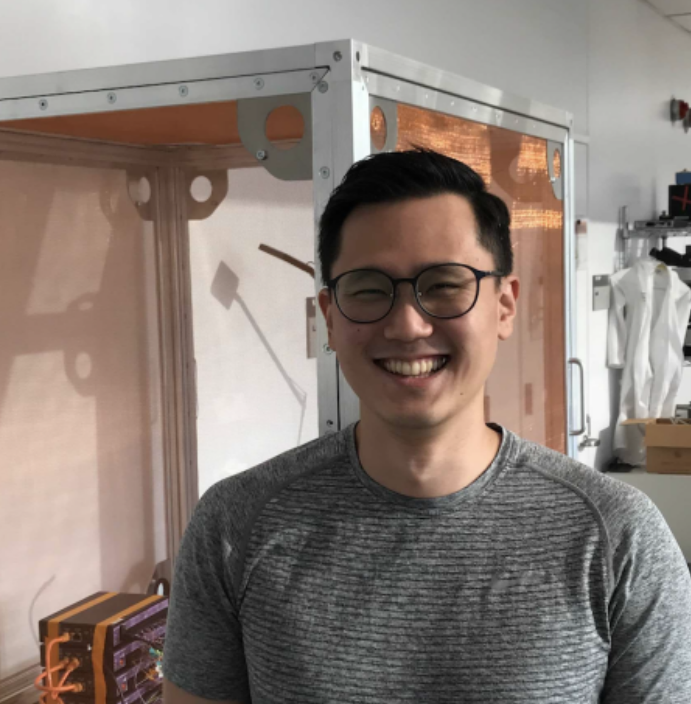

# Kyu Hyun Lee

I'm a neuroscientist interested in understanding how intelligent systems work, in particular how sensory information and internal representations interact to guide behavior. I’m currently a postdoctoral scholar in Loren Frank’s lab at UCSF and completed my PhD in Markus Meister’s lab at Caltech. Learn more about my [research](./research.md) or view my [CV](./img/CV.pdf).
